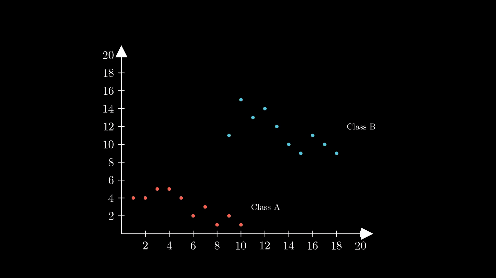

<h2> Introduction </h2>

In the ever-evolving landscape of machine learning, Support Vector Machines (SVMs) stand tall as a formidable force. These remarkable algorithms transformed the way we approach pattern recognition and classification. With their ability to unravel complex relationships and make precise decisions, SVMs have become a go-to tool for data scientists across diverse domains.

In this guide, we take a grounded perspective, exploring the core concepts of SVMs and their real-world applications. SVMs excel in finding decision boundaries and navigating through intricate data landscapes, making them an invaluable asset in the data scientist's toolkit. Whether you're a curious learner or a seasoned practitioner, this guide aims to provide a realistic understanding of SVMs. We'll unravel their inner workings, examine their strengths and limitations, and discuss practical considerations for successful implementation.

So let's get right into it!

<h3> What are Support Vector Machines? </h3>

A support vector machine or SVM is a supervised learning algorithm that is primarily used for classification task (dealing with categorical data) , but can also be used for regression tasks (dealing with quantitative data). When dealing with classification tasks, the aim of an SVM is to find an optimal boundary called a *hyperplane* that can seperate data points of two or more classes. This optimization is done by maximizing the distance of the boundary - also called the *margin* - from the nearest data points of each class. These nearest data points are known as *support vectors*, hence the name *Support Vector Machine*.

<h3> Intuition on Hyperplanes and Support Vectors </h3>

In the paragraph above I define hyperplanes as a boundary, more so, a *decision boundary* which can separate groups of datapoints that lie together. But what exactly are those terms? For that, let's take an example. 

Suppose we have a dataset with two features X and Y, and a categorical target variable with classes A (Red Points) and B (Blue Points). This will form a two dimensional plot as below :

Now, we have any a new datapoint that lies on the graph - how will can we tell if the point belongs to class A or class B? For that, we can take a simple approach : draw a line (or a curve, more on that later) between the points which best represents the border between the area that the two classes occupy. This line is called a decision boundary. However, we can draw infinitely many lines between the space of the points of the two classes, so what's the best line we can draw?

A support vector machine allows us to optimize this line, and the line is called a hyperplane. In fact, the hyperplane may not need be a line at all. A hyperplane is n-1 dimensional, where n is the number of features. So when we have two features, like in the case above, the hyperplane is a line. When we have 3 features, the line becomes a plane.

