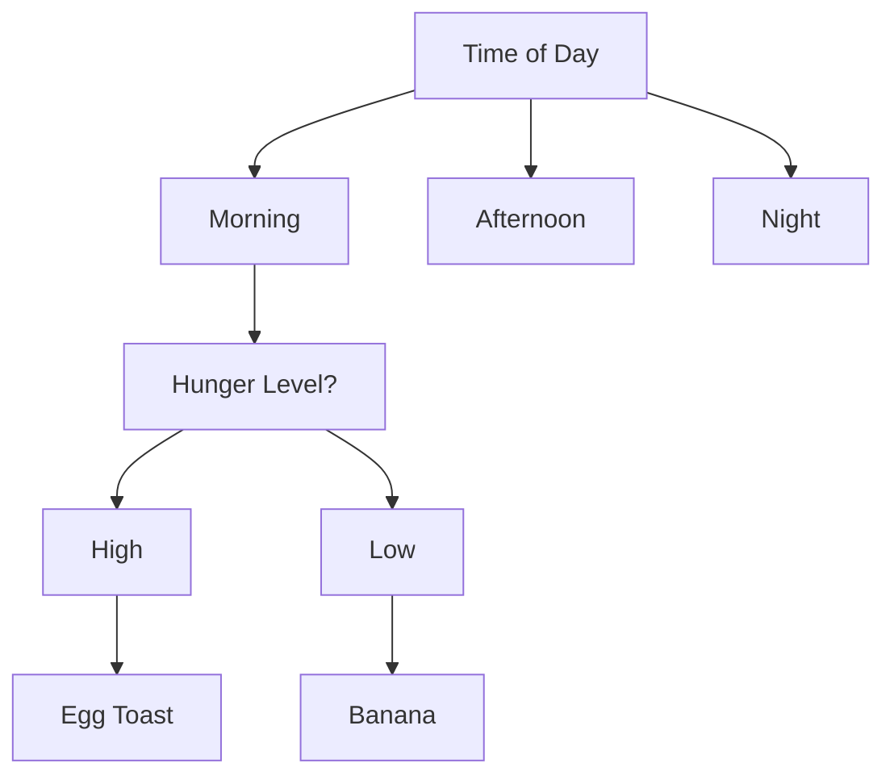

## What is an Algorithm?

We see the word **Algorithm** pop up everywhere. However, the meaning of an algorithm is often only superficially explored upon. What exactly is an algorithm? It may be hard to come up with an exact definition - but I realize this probably is a consequence of it being such a loosely used word.

But when you study computer science, you always deal with algorithms. It's important to have a specific definition of something so important. 

We can describe an algorithm as a finite list of steps that allow us to achieve some goal or solve a particular problem. It has an input and an output. An algorithm should always be finite by definition, i.e. ; it should halt and produce a result. Most things we do are by following an algorithm. A recipe is an algorithm, so is how we tie laces. The way we think is often also an algorithm.

Here’s a real life algorithm on how a person may decide on a place to eat :

## Analysis of Algorithms

An algorithm must have properties that can be ascertained through qualitative or quantitative analysis. One such measure is the *correctness* of an algorithm, another is the *efficiency* and *scalability*. Analyzing algorithms is important because it can help us identify what algorithm may work best for a given task, improve existing algorithms as well as investigate different scenarios.

A very popular method to analyze algorithms is called *Asymptotic Analysis*.

## Asymptotic Analysis

Asymptotic analysis of a function allows us to analyze how any given function or an algorithm grows when its input grows larger and larger, also called the computational complexity of an algorithm. It helps us analyze how resource intensive an algorithm is. It is a more objective and standardized way of analyzing an algorithm's performance. 

The complexity of an algorithm can be measured in various attributes : 

1. **Time Complexity :** It is the time an algorithm will take to complete execution as a function of a given input size.
2. **Space Complexity :** It is the space an algorithm will be requiring to execute completely as a function of input size.

 Asymptotic analysis is described using **asymptotic notation**, which is a form of mathematical notation. Any asymptotic informal notation for a given function $$f(n)$$$ is of the form $$X(g(n))$$, where $$X$$$ is one of the asymptotic notations that will be discussed below. There are different types of asymptotic notations to describe function growth in different ways. Asymptotic notation is comparative; i.e.; it compares the function to others and tries to determine if the given function scales similarly to the other said functions.

Finally, these are the most asymptotic notations most commonly dealt with :

- **Big-Oh Notation : $$O(g(n))$$**
- **Omega Notation : $$\Omega(g(n))$$**
- **Theta Notation : $$\Theta(g(n))$$**
- **Little-Oh Notation : $$o(g(n))$$**
- **Little-Omega Notation : $$\omega(g(n))$$**

### Big-Oh Notation

The Big-Oh notation describes a function $$g(n)$$ for every function $$f(n)$$, such that when $$g(n)$$ is multiplied  by a positive constant *c*, it acts as the upper bound on a function's growth rate for any sufficiently large input. It can also be called the worst possible way a function may scale with increasing size of inputs. In $$O$$ notation, the $$O(g(n))$$ is pronounced as "order of" the argument function $$g(n)$$.  

Through this information, we can denote this mathematically :

Suppose we have an input size of $$n$$, where $$\forall n\ge n_0$$

Then, if 
\begin{equation}
f(n) \le c* g(n)\\
\Rightarrow f(n) = O(g(n))
\end{equation}

Let's consider the function $$f(n) = n^2 + 1$$. If $$n = 1$$, the function outputs 2. If $$n = 2$$, the function outputs 5. If $$n = 3\ , f(n) = 29$$. If we plot the function, we can see that it grows similarly to $$g(n) = n^2$$. Here, the red curve is $$g(n) = n^2 + 1$$. Meanwhile, the green curve is $$f(n) = n^2$$. We can see that both functions somewhat scale similarly.

    

        
    

However, right now the function $$f(n)$$ seems to scale larger than $$g(n)$$. Let's consider the condition for Big-Oh notation again : $$f(n) \le c* g(n) \Rightarrow f(n) = O(g(n))$$. Hence if we multiply $$g(n)$$ by a constant, say $$c=2$$, we get this:

This in fact, is the order of the function $$f(n)$$, an abstracted way of understanding how the function grows by comparing it to other simple functions. Appropriately, $$g(n)$$ grows in the order of itself : as in $$O(n^2 +1 )$. However, when doing asymptotic analysis - we largely tend to ignore the lower order terms since they offer little contribution to how the function scales with big input sizes.

Let's look at the same example through the help of a graph.

    

        
    

Now, $$g(n)$$ scales faster than $$f(n)$$ after $$n \ge 2$$, hence $$n_0 = 2$$. This means $$g(n)$$ will always act as the upper bound for $$f(n)$. Hence we $$f(n)$$ to be $$O(n^2)$. 

#### Why's Big-Oh Notation Useful?

Big-Oh notation is perhaps the most used form of complexity analysis in the scientific and professional world. This is done because of its direct definition : it offers an upper bound on the function's complexity. This is why when we talk about something running in $O(n)$, we know that the complexity of said program is at most linear. There's a lot of runtimes that are popular benchmarks for programs.

##### Popular Runtimes

|  Notation  |      Runtime      |
| :--------: | :---------------: |
|   $$O(1)$$   |   Constant Time   |
| $$O(logn)$$  | Logarithmic Time  |
|   $$O(n)$$   |    Linear Time    |
| $$O(nlogn)$$ | Linearithmic Time |
|  $$O(n^2)$$  |  Quadratic Time   |
|  $$O(n^k)$$  |  Polynomial Time  |
|  $$O(2^n)$$  | Exponential Time  |
|  $$O(n!)$$   |  Factorial Time   |

### **Big-Omega Notation $$(\Omega)$$**

In some ways, $$\Omega$$-notation is the opposite of Big-Oh notation. $$\Omega$$-notation of a function $$f(n)$$ provides us with the lower bound of the function's runtime instead of the upper bound. Together with $$O$$ notation, it provides a more complete asymptotic analysis of a function's performance in runtime. 

$$\Omega$$-notation can be represented mathematically : 

$$
0 \le c*g(n) \le f(n) \ , \forall n >= n_0
$$

$$
\Rightarrow f(n) = \Omega(g(n))
$$

Hence, there exists a function $$g(n)$$ for a given function $$f(n)$$, such that when $$g(n)$$ is multiplied by a positive constant $$c$$, it is lower than or equal to the function $$f(n)$$ and acts as a lower bound on the function. Then, $$f(n) = \Omega(g(n))$$.

Let's try to explain $$\Omega$$-notation and $$O$$-notation through an example. Again, let's assume $$f(n) = n^2+1$$. Through the previous example when explaining $$O$$-notation we established how this expression is $$O(n^2)$$.  For the $$\Omega$$-notation, let's take a function $$g(n)=n$$. Substituting $$f(n)$$ and $$g(n)$$ the definition of $$\Omega$$-notation:

$$
0 \le c*n \le n^2+1 \ , \forall n >= n_0
$$

We can take $$c=2$$ and $$n_0 = 1$$ and we will have :

$$
0 \le 2n \le n^2+1 \ , \forall n >= 1
$$

Since the inequality stands true, $$f(n) = \Omega(n)$$. 

Let's try plotting this inequality in desmos:

    

        
    

Where, $$f(n) = n^2+1$$ is the red line and $$g(n) = n$$ is the green one.

This means the function $$g(n) = n$$ is the lower bound of $$f(n)$$ ; i.e.; the function $$f(n)$$ will take **at least** as much time as $$g(n) = n $$, but may take more. For $O$-notation, if the function $$f(n)$$ will take **at most** as much time as $$g(n) = n^2$$.

### Theta-Notation ($$\Theta$$)

$$\Theta$$-notation is a tight bound on a function : it is the combination of the high and low bounds. It denotes an algorithm's performance in a well defined and specific range. It is meant to be a more precise tool for asymptotic analysis. 

If we're given a function $$f(n)$$ and another function $$g(n)$$, and we can define constants $$c_1, c_1$$ and $$n_0$$ such that , $$\forall n\ge n_0$$:
$$
0 \le c_2*g(n) \le f(n)
$$

$$
0\le f(n) \le c_1*g(n)
$$

then,
$$
f(n) = \Theta(g(n))
$$

The function $$f(n)$$ is said to be sandwiched between the two bounds here, hence it's tightly fixed in place.

From our previous example with $$f(n) = n^2 +1$$, if we have $$g(n) = n^2$$ , we can put $$c_1 = 1, c_2 = 2$$ and $$n_0 = 1$$ :
$$
0\le 2*n^2 \le n^2+1
$$

$$
0\le n^2 +1 \le 1*n^2
$$

Hence, 
$$
f(n) = \Theta(n^2)
$$

### Small-Oh Notation ($$o$$)

